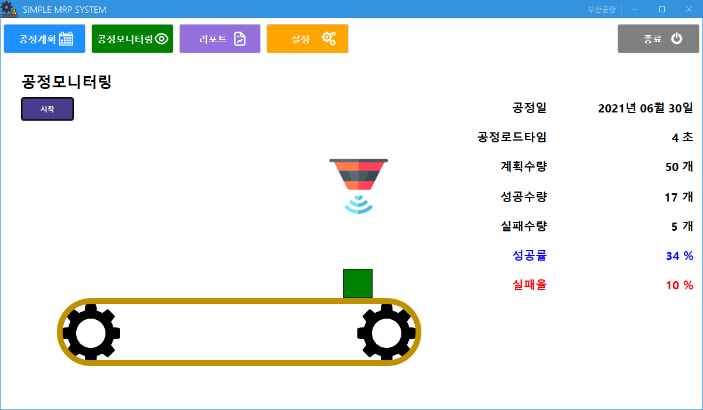

# ✅ MiniProject_simpeMRP APP ✅

```
 - MQTT 서버에 MRP앱, 라즈베리파이를 클라이언트로 연결한후에 
   라즈베리파이에서 publish한 data를 MRP앱에서 subscribe한다.
   
 - MRP앱에서는 공정계획, 공정모니터링, 리포트, 설정 등의 기능을 DB와 연결하여 data를 저장한다.
 
```


```C#
using Newtonsoft.Json;
using System;
using System.Collections.Generic;
using System.Diagnostics;
using System.Linq;
using System.Net;
using System.Text;
using System.Timers;
using System.Windows;
using System.Windows.Controls;
using System.Windows.Media;
using System.Windows.Media.Animation;
using System.Windows.Threading;
using uPLibrary.Networking.M2Mqtt;
using uPLibrary.Networking.M2Mqtt.Messages;

namespace MRPApp.View.Process
{
    /// <summary>
    /// ProcessView.xaml에 대한 상호 작용 논리
    /// 1. 공정계획에서 오늘의 생산계획 일정을 불러온다.
    /// 2. 없으면 Error표시하고 시작버튼을 비활성화
    /// 3. 공정이 있으면 오늘의 날짜를 표시해주고 시작버튼 활성화
    /// 3-1. Mqtt Subscription 연결해서 factory1/machine1/data 확인!
    /// 4. 시작버튼을 누르면 새 공정을 만들어 DB에 입력
    ///    => 공정코드 : RRC20210628001( PRC+yyyy+MM+dd+NNN)
    /// 5. 공정처리 애니메이션 시작
    /// 6. 로드타임 후 애니메이션 중지
    /// 7. 센서링값 리턴될때까지 대기
    /// 8. 센서링 결과값에 따라서 생산품 색상 변경
    /// 9. 현재 공정의 DB값 업데이트
    /// 10. 결과 레이블 값 수정/표시
    /// </summary>
    /// 
    public partial class ProcessView : Page
    {
        // 금일 일정
        private MRPAPP.Model.Schedules currSchedule;

        public ProcessView()
        {
            InitializeComponent();
        }
        private async void Page_Loaded(object sender, RoutedEventArgs e)
        {
            try
            {
                var today = DateTime.Now.ToString("yyyy-MM-dd");
                currSchedule = Logic.DataAccess.GetSchedules().Where(s => s.PlantCode.Equals(Commons.PLANTCODE))
                                .Where(s => s.SchDate.Equals(DateTime.Parse(today))).FirstOrDefault();

                if(currSchedule == null)
                {
                    await Commons.ShowMessageAsync("공정", "공정계획이 없습니다.");
                    // TODO 시작 버튼 비활성화
                    LblProcessDate.Content = string.Empty;
                    LblSchLoadTime.Content = "None";
                    LblSchAmount.Content = "None";
                    BtnStartProcess.IsEnabled = false;
                    return;
                }
                else
                {
                    // 공정계획 표시 
                    MessageBox.Show($"{today} 공정 시작합니다.");
                    LblProcessDate.Content = currSchedule.SchDate.ToString("yyyy년 MM월 dd일");
                    LblSchLoadTime.Content = $"{currSchedule.SchLoadTime} 초";
                    LblSchAmount.Content = $"{currSchedule.SchAmount} 개";
                    BtnStartProcess.IsEnabled = true;

                    UpdateData();
                    InitConnectMqttBroker(); // 공정시작시 MQTT 브로커에 연결
                }
            }
            catch (Exception ex)
            {
                Commons.LOGGER.Error($"예외발생 ProcessView Loaded : {ex}");
                throw ex;
            }
        }
        // 전역변수 선언
        MqttClient client;
        Timer timer = new Timer();
        Stopwatch sw = new Stopwatch();

        // mqtt 서버에 연결해서 라즈베리에서 publish한 데이터를 subscribe하는 메서드
        private void InitConnectMqttBroker()
        {
        // broker에 연결
            var brokerAddress = IPAddress.Parse("210.119.12.86"); // 본인 컴퓨터 mqtt 브로커 IP
            client = new MqttClient(brokerAddress);
            client.MqttMsgPublishReceived += Client_MqttMsgPublishReceived;
        // topic 설정
            client.Connect("Monitor");
            client.Subscribe(new string[] { "factory1/machine1/data/" }, new byte[] { MqttMsgBase.QOS_LEVEL_AT_MOST_ONCE});
        // 타이머 시작
            timer.Enabled = true;
            timer.Interval = 1000;
            timer.Elapsed += Timer_Elapsed;
            timer.Start();
        }

        private void Timer_Elapsed(object sender, ElapsedEventArgs e)
        {
        // 2초가 지나면 데이터 입력
            if (sw.Elapsed.Seconds >= 2)    
            {
                sw.Stop();
                sw.Reset();
                //MessageBox.Show(currentData["PRC_MSG"]);
                if (currentData["PRC_MSG"] == "OK")
                {
                    Dispatcher.Invoke(DispatcherPriority.Normal, new Action(delegate
                    {
                        Product.Fill = new SolidColorBrush(Colors.Green);
                    }));
                }
                else if (currentData["PRC_MSG"] == "FAIL")
                {
                    Dispatcher.Invoke(DispatcherPriority.Normal, new Action(delegate
                    {
                        Product.Fill = new SolidColorBrush(Colors.Red);
                    }));
                }

                Dispatcher.Invoke(DispatcherPriority.Normal, new Action(delegate
                {
                    UpdateData();
                }));
            }
        }

        private void UpdateData()
        {   // 성공수량
            var prcOkAmount = Logic.DataAccess.GetProcess().Where(p => p.SchIdx.Equals(currSchedule.SchIdx))
                                .Where(p => p.PrcResult.Equals(true)).Count();
            // 실패수량
            var prcFailAmount = Logic.DataAccess.GetProcess().Where(p => p.SchIdx.Equals(currSchedule.SchIdx))
                                .Where(p => p.PrcResult.Equals(false)).Count();
            // 공정 성공률
            var prcOkRate = ( (double)prcOkAmount / (double)currSchedule.SchAmount ) * 100;
            // 공정 실패율
            var prcFailRate = ((double)prcFailAmount / (double)currSchedule.SchAmount) * 100;

            LblPrcOkAmount.Content = $"{prcOkAmount} 개";
            LblPrcFailAmount.Content = $"{prcFailAmount} 개";
            LblPrcOkRate.Content = $"{prcOkRate} %";
            LblPrcFailRate.Content = $"{prcFailRate} %";
        }

        Dictionary<string, string> currentData = new Dictionary<string, string>();

        private void Client_MqttMsgPublishReceived(object sender, MqttMsgPublishEventArgs e)
        {
            var message = Encoding.UTF8.GetString(e.Message);
            currentData = JsonConvert.DeserializeObject<Dictionary<string, string>>(message);

            if (currentData["PRC_MSG"] == "OK" || currentData["PRC_MSG"] == "FAIL")
            {
                sw.Stop();
                sw.Reset();
                sw.Start();

                StartSensorAnimation();
            }
        }

        private void StartSensorAnimation()
        {  // 스레드를 분리하여 접근하기 위해서 Dispatcher 사용!!
            Dispatcher.Invoke(DispatcherPriority.Normal, new Action(delegate
            {
                DoubleAnimation ba = new DoubleAnimation();
                ba.From = 1; // 이미지 보임
                ba.To = 0;   // 이미지 보이지 않음
                ba.Duration = TimeSpan.FromSeconds(2);
                ba.AutoReverse = true;
                //ba.RepeatBehavior = RepeatBehavior.Forever; // 무한반복

                Sensor.BeginAnimation(Canvas.OpacityProperty, ba);
            }));
        }

        private void BtnStartProcess_Click(object sender, RoutedEventArgs e)
        {
            if (InsertProcessData())            // data삽입에 성공하면,,,,
                StartAnimation();               // HMI 애니메이션 실행
        }

        // DB에 Process테이블에 데이터 넣는 메서드
        private bool InsertProcessData()
        {
            var item = new MRPAPP.Model.Process();
            item.SchIdx = currSchedule.SchIdx;
            item.PrcCd = GetProcessCodeFromDB();
            item.PrcDate = DateTime.Now;
            item.PrcLoadTime = currSchedule.SchLoadTime;
            item.PrcStartTime = currSchedule.SchStartTime;
            item.PrcEndTime = currSchedule.SchEndTime;
            item.PrcFacilityID = Commons.FACILITYID;
            item.PrcResult = true; // 일단 공정성공으로 시작해야함 
            item.RegDate = DateTime.Now;
            item.RegID = "MRP";

            try
            {
                var result = Logic.DataAccess.SetProcess(item);
                if (result == 0)
                {
                    Commons.LOGGER.Error("공정데이터 입력 실패!");
                    Commons.ShowMessageAsync("오류", "공정시작 오류발생, 관리자 문의");
                    return false;
                }
                else
                {
                    Commons.LOGGER.Info("공정 데이터 입력!");
                    return true;
                }
            }
            catch (Exception ex)
            {
                Commons.LOGGER.Error($"예외발생 : {ex}");
                Commons.ShowMessageAsync("오류", "공정시작 오류발생, 관리자 문의");
                return false;
            }
        }
        // PrcCd 구하는 메서드
        private string GetProcessCodeFromDB()
        {
            var prefix = "PRC";
            var prePrcCode = prefix + DateTime.Now.ToString("yyyyMMdd"); // PRC20210629
            var resultCode = string.Empty;

            // 이전까지 공정이 없어 PRC20210629...값이 없으면 null반환, 값이 있으면 마지막 값이 넘어온다.
            //                                      --> 마지막3자리에서 1을 더해서 생성한다.
            var maxPrc = Logic.DataAccess.GetProcess().Where(p => p.PrcCd.Contains(prePrcCode))
                                .OrderByDescending(p => p.PrcCd).FirstOrDefault();

            if(maxPrc == null)                  // 이전까지 값이 없어 null이 넘어온 경우,,,,001만 붙혀서 새로 생성
            {
                resultCode = prePrcCode + "001";
            }
            else                                // 이전 값이 있어서 마지막 값이 넘어온 경우,,,,마지막 숫자에 001을 더해서 다음 값 생성
            {
                var maxPrcCd = maxPrc.PrcCd;    // PRC20210629004
                var maxVal = int.Parse(maxPrcCd.Substring(11)) + 1; // 004 -> 4 + 1 -> 5

                resultCode = prePrcCode + maxVal.ToString("000");
            }

            return resultCode;
        }

        // 애니메이션 기능 메서드
        private void StartAnimation()
        {
            Product.Fill = new SolidColorBrush(Colors.Gray);  // 상자색 회색으로 초기화

            // 기어 회전 애니메이션 (double애니메이션)
            DoubleAnimation da = new DoubleAnimation();
            da.From = 0;
            da.To = 360;
            da.Duration = TimeSpan.FromSeconds(currSchedule.SchLoadTime); //주기 => 로드타임
            //da.RepeatBehavior = RepeatBehavior.Forever; // 무한반복

            RotateTransform rt = new RotateTransform();
            Gear1.RenderTransform = rt; // 기어1 설정
            Gear1.RenderTransformOrigin = new Point(0.5, 0.5); // 중심점 정하기
            Gear2.RenderTransform = rt; // 기어2 설정
            Gear2.RenderTransformOrigin = new Point(0.5, 0.5); // 중심점 정하기

            rt.BeginAnimation(RotateTransform.AngleProperty, da);

            // 제품 수직이동 애니메이션(move애니매이션)
            DoubleAnimation ma = new DoubleAnimation();
            ma.From = 136;
            ma.To = 550;
            ma.Duration = TimeSpan.FromSeconds(currSchedule.SchLoadTime);
            //ma.AccelerationRatio = 0.5; // 가속도(서서히 속도 높임)
            //ma.AutoReverse = true; // 끝까지 돌아가면 다시 돌아오는 반복 

            Product.BeginAnimation(Canvas.LeftProperty, ma);
        }

        private void Page_Unloaded(object sender, RoutedEventArgs e)
        {
            // 자원해제 ==> 재시작때 오류를 없애기위해서, 메모리상에 쓰레드가 남지 않게 하기 위해서
            if (client.IsConnected) client.Disconnect();
            timer.Dispose();
        }
    }
}

```
